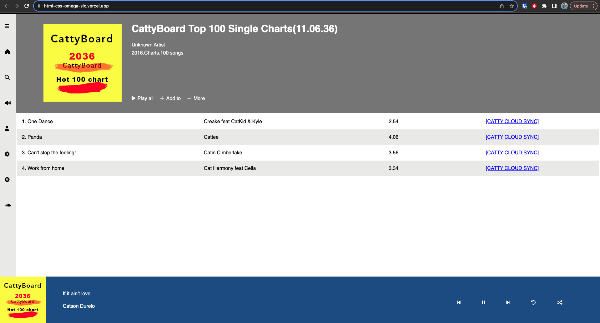

# HTML/CSS Landing Page Project: CattyBoard

Welcome to the **Pesto HTML/CSS Landing Page Project**! In this project, we have created a landing page for CattyBoard, an online music platform, following the guidelines provided by Pesto. The project showcases the use of HTML and CSS to create a visually appealing and interactive landing page.

## Project Overview

Screenshot:

The Pesto HTML/CSS Landing Page Project aims to create an engaging and well-designed landing page for CattyBoard, featuring an album image, sidebar navigation, song list, and footer with player controls. The project focuses on adhering to the given UI design, using the "Lato" font for text, and utilizing the Line Awesome icon library for various icons.

## Features

- **Responsive Design:** The landing page is designed to be responsive, ensuring a seamless experience across different screen sizes and devices.

- **Sidebar Navigation:** The sidebar navigation contains icons representing different actions, enhancing user accessibility.

- **Album Image:** The album image is prominently displayed at the top of the page, capturing users' attention.

- **Song List:** The song list is presented in a table format, displaying song titles, artists, and durations.

- **Footer Controls:** The footer provides player controls, allowing users to control song playback, shuffle, and more.

## How to Use

To explore the Pesto HTML/CSS Landing Page Project:

1. Clone the GitHub repository or download the project files.

2. Open the `index.html` file in your web browser.

3. Explore the landing page's layout, navigation, and visual elements.

4. Interact with the sidebar icons and footer controls to experience the interactive features.

5. Inspect the HTML and CSS code to understand how the landing page is structured and styled.

## Technologies Used

The Pesto HTML/CSS Landing Page Project is developed using the following technologies:

- HTML: For creating the landing page's structure and content.

- CSS: For styling the visual elements, layout, and responsive design.

- Line Awesome: An icon library used to include various icons in the UI.

## Acknowledgments

We would like to express gratitude to Pesto for providing the project guidelines and opportunities to practice web development skills.

## Credits

This project demonstrates the importance of combining HTML and CSS to create visually appealing and user-friendly landing pages. It showcases the use of fonts, icons, images, and responsive design principles.

---

Discover the captivating CattyBoard landing page, where music meets design. Immerse yourself in a seamless and interactive experience as you explore the world of online music through thoughtful UI design and engaging features. 🎵🎧🎉
