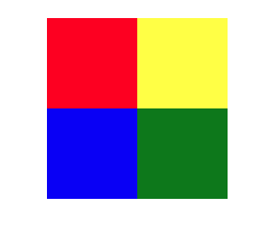
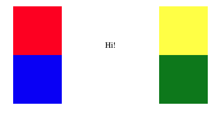

# Pesto CSS Project: Animated Coloured Squares

Welcome to the **Pesto CSS Landing Page Project**! In this project, we have created a visually appealing landing page that features animated colored squares. The project focuses on applying CSS transitions to achieve an engaging effect where the squares open up and rotate by 90 degrees when the main div is hovered.

You can check it out on this link: [Animated Coloured Squares](https://pesto-projects.vercel.app/) 

## Project Overview

Before:

After:

The Pesto CSS Landing Page Project showcases the creative use of CSS transitions to animate colored squares. The landing page includes a main div that, when hovered over, triggers a visually captivating transformation of the squares. Each square rotates around its outer-most corner, creating a unique and dynamic visual effect.

## Features

- **CSS Transitions:** The main feature of the project is the application of CSS transitions to achieve smooth animations. When the main div is hovered, the colored squares open up and rotate by 90 degrees.

- **Colored Squares:** The landing page contains multiple colored squares that serve as visual elements for the animation.

- **Interactive Design:** Users can interact with the landing page by hovering over the main div to trigger the animation.

## How to Use

To explore the Pesto CSS Landing Page Project:

1. Clone the GitHub repository or download the project files.

2. Open the `index.html` file in your web browser.

3. Hover over the main div to witness the animated colored squares opening up and rotating by 90 degrees.

4. Observe the smooth transitions and the visually appealing effect created by the CSS animations.

5. Examine the CSS code in the `styles.css` file to understand how the transitions and animations are applied.

## Technologies Used

The Pesto CSS Landing Page Project is developed using the following technology:

- CSS: For creating the animations, transitions, and styling of the colored squares and main div.

## Acknowledgments

We extend our gratitude to Pesto for providing the project guidelines and encouraging the exploration of CSS transitions and animations.

## Credits

This project showcases the potential of CSS transitions to add dynamic and engaging visual effects to web pages. The animated colored squares demonstrate the creative possibilities that CSS offers for enhancing user interactions and making web content more visually appealing.

---

Dive into the captivating world of CSS animations and transitions with the Pesto CSS Landing Page Project. Experience the art of transforming static elements into dynamic visual delights as you explore the power of CSS to create engaging and interactive web experiences. Witness the magic of animated colored squares that open up and rotate with the gentle hover of a mouse. 🎨✨🔲
