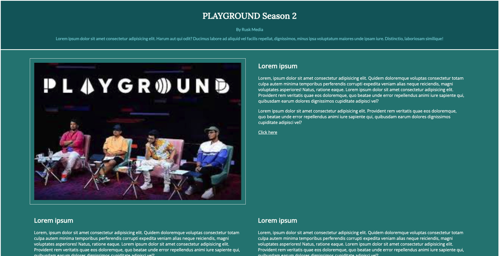

# Pesto HTML/CSS Landing Page Project: 

Welcome to the **Pesto HTML/CSS Landing Page Project**! In this project, we have created a personalized landing page based on our interests, following the guidelines provided by Pesto. The project showcases the use of HTML and CSS to create a visually appealing and responsive webpage.

You can check it out on this link: [Landing Page](https://webpage-html-css-two.vercel.app/) 

## Project Overview

The Pesto HTML/CSS Landing Page Project aims to create an engaging and stylish landing page that reflects our interests. The page includes a consistent color scheme, a header with a title and description, an articles section with summaries and links, a footer with information about the site, and a form with client-side validation.

## Features

- **Responsive Design:** The landing page is designed to be responsive, adapting to different screen sizes and devices.

- **Color Scheme:** A consistent color scheme is applied to links, text, and buttons throughout the page.

- **Header:** The header features a captivating title and a brief description of the site's purpose.

- **Articles Section:** The articles section presents a collection of articles, each with a title, summary, and link to the full article.

- **Footer:** The footer contains information about the site's creator or additional details.

- **Form with Validation:** A user-friendly form is included with various fields, and client-side validation ensures proper data entry.

- **Two-Column Layout:** On larger devices, a two-column layout is implemented. On smaller devices, the right-side content stacks below the image.

- **Grid Layout:** Additional articles are added and presented in a grid layout, with three articles per row.

- **Button Styling:** The form's submit button is styled with a chosen color, and its color changes on hover.

## How to Use

To explore the Pesto HTML/CSS Landing Page Project:

1. Clone the GitHub repository or download the project files.

2. Open the `index.html` file in your web browser.

3. Browse through the landing page's layout, articles, form, and visual elements.

4. Interact with the form to experience client-side validation.

5. Adjust the window size to observe the responsive design and layout changes.

6. Examine the HTML and CSS code to understand how the landing page is structured and styled.

## Technologies Used

The Pesto HTML/CSS Landing Page Project is developed using the following technologies:

- HTML: For creating the landing page's structure, content, and form.

- CSS: For styling the visual elements, layout, color scheme, and responsive design.

## Acknowledgments

We extend our gratitude to Pesto for providing the project guidelines and encouraging the exploration of web development concepts.

## Credits

This project highlights the process of designing and building a personalized landing page while demonstrating the practical application of semantic HTML and CSS styling techniques.

---

Explore the captivating world of personalized web design with the Pesto HTML/CSS Landing Page Project. Immerse yourself in a creative experience that combines visual aesthetics with responsive design principles. Witness the power of HTML and CSS as you craft a unique and engaging webpage that reflects your interests and ideas. 🌟🎨🌐
