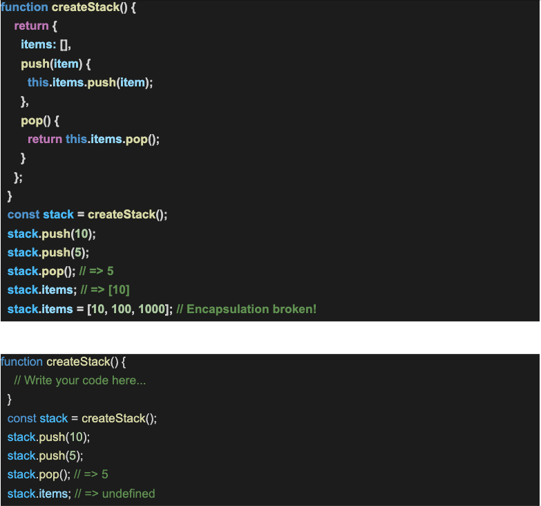

## Assignment 1:
Create a memoize function that remembers previous inputs and stores them in cache so that itwon’t have to compute the same inputs more than once. The function will take an unspecifiednumber of integer inputs and a reducer method.

## Assignment 2:
Create 3 simple functions where call, bind and apply are used. The intention of this exercise isto understand how they work and their differences.

## Assignment 3:
What is the output of the below problem and why:

## Assignment 4:
Refactor the above stack implementation, using the concept of closure, such that there is noway to access items array outside of createStack() function scope:

